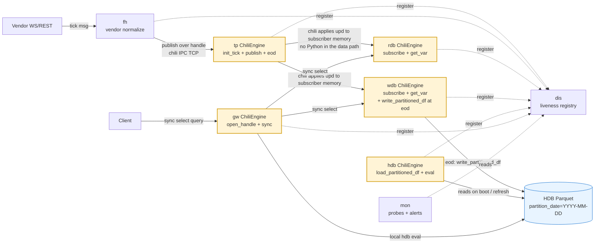

# mdata → chili — architecture handoff for chili-team review (**Revision A**)

**Date:** 2026-05-24 (revised same day after chili-author feedback)
**From:** mdata project (`claude` branch, `~/code/mdata`)
**To:** chili-team and the chili original author — to inform chili 0.9.x design
**Mirror:** `~/code/chili/docs/sync/mdata_architecture_handoff_2026-05-24.md` (identical content)

## Revision history

- **v1** (commits `b3774ae` / `b124400`; `1ee7c94` / `f2041a8`, 2026-05-24): initial draft. Framed mdata as orchestrating chili — drain loops, periodic flushers, EOD shims wired through Python.
- **The chili author pushed back** (relayed 2026-05-24): *"The data shall go one direction… Python needs a pointer to the data in chili, not polling. get_var is for this purpose… set up a tp and rdb using subscribe and publish from the Chili Engine. If this doesn't work, I will add whatever that is missing. You should not trying to take over something that is done in chili syntax… The flush_tp_logs and upd_notify_fd_ready make things unnecessarily complicated. You should be a 'user' of chili-sauce and setup data pipelines instead."*
- **Revision A (this commit)** — wholesale rewrite. mdata's architecture re-grounded in the canonical **kdb+tick / TorQ tickerplant pattern**. Branch comparison `main` (chili 0.9.0) vs `claude-2` (mdata-driven extensions) with **verdict per claude-2 feature**: which mdata genuinely needs, which is over-engineering on mdata's side, which is a wishlist item.

## TL;DR for the chili author

You are right. mdata's current implementation has been **taking over chili's job** in several places. After re-grounding in chili main 0.9.0's public API + canonical kdb+tick patterns:

- **~600 LOC of mdata code is over-engineering** and can be removed: drain-loop, cursor-store, A-034 EOD shim, `_after_drain` hooks, parts of periodic_flush.
- **chili main 0.9.0 already covers ~85% of mdata's actual needs.** Including EOD — `test_subscriber_eod_dispatch.py` on `main` is the exact pattern A-034 was reinventing.
- **Genuine wishlist: ONE primitive** — configurable auto-flush in `init_tick` for PRD §5.1 part-2 durability SLA (within 10 ms of publish; main relies on OS page-cache, ~30 s default flush).
- **Two claude-2 features need confirmation, not assumed over-engineering**: `publish_via_handle` (fh→tp wire transfer ergonomics) and `roll_tick` atomicity (vs main's `roll_tick_log` pepper wrapper). Either keep in claude-2, port to main, or replace with a documented main-side workaround.

Everything else (`drain_upds`, `upd_notify_fd`, `subscribe(resume_from=)`, `flush_tplog` called from Python, custom EOD shim plumbing, register_fn-based pepper dispatch from Python) is **mdata-side over-engineering** and will be removed in a v1-36 architecture-cleanup sprint.

The proof point you asked for — *"claude needs to set up a test case, make sure it works"* — lands as the first commit of that cleanup sprint: `tests/integration/test_chili_user_pattern.py` exercising mdata's schemas through `init_tick + publish + subscribe + get_var + eod()` only.

---

## 1. Canonical pattern — kdb+tick / TorQ alignment

mdata is a multi-asset time-series warehouse modelled on the kdb+tick / TorQ tickerplant pattern. The invariants of that pattern are:

| kdb+tick invariant | chili main 0.9.0 mechanism |
|---|---|
| Data flows ONE direction: feed → tp → subscribers | `tp.publish(table, df)`; chili-IPC carries to subscribers; subscriber's chili engine applies the upd to its own table memory |
| Subscribers are passive recipients; tp owns the canonical write | `subscriber.subscribe(uri, topics)` once; chili internally calls `.tick.upd` on subscriber side |
| Subscriber-side `upd` is a row-applier; no orchestration in user code | chili pepper `.tick.upd` handler is registered by `subscribe`; user code does NOT touch it |
| Subscribers query via natural q `select` — data is already there | `subscriber.get_var("trade")` returns the current state; or `subscriber.eval("select ...")` |
| No subscriber "drain" or "poll" in the data path | Just `get_var()` on demand (or via pepper `eval`) |
| EOD: tp `.u.end[date]` broadcasts; subscriber `.u.end` handles | `pub.eod(date)` broadcasts; subscriber pre-defines pepper `eod: {[msg] ...}` handler |
| Full replay on restart from tplog is accepted | `subscribe()` triggers replay; no resume cursor needed |
| tplog is source of truth; flush is automatic/configured | Configurable in chili (today via `flush_tplog` from Python; wishlist: chili-side auto-flush config) |
| Gateway routes queries; doesn't orchestrate ingest/flush | `gw` engine opens handles to rdb/wdb via `open_handle`; queries via `sync(h, "select ...")` |

mdata's current code **diverges from this in 5 places**, all on mdata's side, not chili's:

1. **Drain-loop polling.** `src/mdata/common/drain_loop.py` (530 LOC) arms `upd_notify_fd` and pumps `drain_upds` events. The chili author explicitly called this out as "unnecessarily complicated".
2. **Cursor persistence.** `src/mdata/common/cursor_store.py` persists chili's per-handle delivery ordinal to disk for `subscribe(resume_from=...)`. kdb+tick canonical pattern just replays the day on restart.
3. **A-034 EOD shim (just shipped v1-35.1).** `src/mdata/wdb/wdb_subscriber.py` reimplements the pepper `eod: {[msg] ...}` handler pattern but wires it through `_after_drain`. main's `test_subscriber_eod_dispatch.py` shows this is a 5-line subscriber-side `eval(...)` — no drain hook needed.
4. **Python-driven tplog flush.** `src/mdata/tp/periodic_flush.py` calls `engine.flush_tplog()` every 100 ms for the §5.1 part-2 durability SLA. Should be a chili-side `init_tick(..., auto_flush_ms=100)` config.
5. **`_after_drain` hooks (rdb + wdb).** Coupling EOD detection + watermark republish to the drain loop. Without the drain loop, these become simple periodic timers or pepper shims.

---

## 2. chili main 0.9.0 — the "user" surface

The full public API surface in `git show main:crates/chili-py/chili/engine.py` is **38 public methods**. The subset mdata actually needs for a true-user-of-chili architecture is **8 methods**:

| Method | Signature | mdata daemon that uses it |
|---|---|---|
| `init_tick(schema, log_dir, date)` | tp boot | tp |
| `publish(table, df)` | local publish | tp (locally) |
| `start_tcp_listener(port)` | IPC listener | tp (so subscribers can connect) |
| `subscribe(tick_socket, topics)` | subscriber connect | rdb, wdb |
| `get_var(name)` | read current state | gw → rdb/wdb (via remote sync); rdb/wdb internally (EOD sentinel) |
| `set_var(name, value)` + `eval("...")` | define pepper shims | rdb, wdb (EOD shim definition at boot) |
| `eod(date)` | EOD trigger (broadcast) | tp |
| `open_handle(uri)` + `sync(h, query)` | remote query | gw → rdb/wdb/hdb; fh → tp (if not using `publish_via_handle`) |

That is the **entire chili surface mdata's daemons should touch**. Everything beyond this list is either chili-internal or mdata over-engineering.

### Canonical pub/sub (verbatim from `test_tick_sub.py` on main)

```python
# Publisher (tp)
t = ChiliEngine(pepper=True)
t.init_tick(schema={"trade": trade_schema}, log_dir=log_dir + "/", date=date.today())
t.start_tcp_listener(port)
t.publish("trade", data1)

# Subscriber (rdb / wdb)
s = ChiliEngine(pepper=True)
s.subscribe(f"chili://127.0.0.1:{port}", ["trade"])
# chili's internal Rust receive thread applies the upd to s's "trade" table.
# Subscriber reads on demand — NO polling, NO drain, NO notify_fd:
sub_trade = s.get_var("trade")
```

That is the **entire** subscriber pattern. The first 30 lines of `test_tick_sub.py` are what every mdata subscriber should look like.

### Canonical EOD (verbatim from `test_subscriber_eod_dispatch.py` on main)

```python
# Subscriber pre-defines the eod shim BEFORE subscribe
sub.eval(".sub.eod.fired: 0n")               # sentinel = pepper null
sub.eval("eod: {[msg] .sub.eod.fired: msg}") # handler
sub.subscribe(f"chili://127.0.0.1:{port}", ["trade"])

# Publisher fires EOD — routes: pub → .broker.eod → signal_eod → sync(h, (`eod; date))
pub.eod(date.today())

# Subscriber detects via the sentinel
for _ in range(100):
    if sub.has_var(".sub.eod.fired"):
        got = sub.get_var(".sub.eod.fired")
        if got is not None:
            eod_msg = got
            break
    time.sleep(0.05)
```

**A-034 in mdata's wdb_subscriber.py is a more complex version of this.** The pepper shim definition is identical; mdata adds `_check_eod`, `_eod_safety_loop`, `_after_drain` wiring. All of that is unnecessary — the canonical pattern is the 5-line `eval` block + a simple polling timer.

---

## 3. main vs claude-2 — per-feature verdict

`git diff --stat main..claude-2 -- crates/chili-py/` shows engine.py +315 LOC + 7 new test files. Verdict on each claude-2 addition, classified by what mdata actually needs:

| claude-2 feature | mdata current use | main equivalent | Verdict |
|---|---|---|---|
| `flush_tplog()` (Sprint 16) | `tp/periodic_flush.py` calls every 100 ms for PRD §5.1 part-2 (kill-9 durability) | None — main relies on OS page-cache flush (~30 s default) | **WISHLIST W1** — request chili-side configurable auto-flush: `init_tick(..., auto_flush_ms=100, auto_flush_bytes=1_048_576)`. mdata removes Python-side flush calls; chili owns flush cadence per config. |
| `upd_notify_fd()` + `drain_upds()` (Sprint 21, D-1) | `common/drain_loop.py` + RdbSubscriber + WdbSubscriber (530 LOC) for cursor advance + cache eviction + EOD trigger | `subscribe()` applies upds internally to subscriber engine memory; user reads via `get_var()` on demand | **OVER-ENGINEERING — DROP.** mdata's three uses all dissolve: cursor advance → drop (full-day replay on restart); cache eviction → don't evict (rdb accumulates intraday; HDB rolls at EOD); EOD trigger → use main's `eod()` + pepper shim. |
| `subscribe(resume_from=dict)` (Sprint 21, D-3) | rdb/wdb restart fast resume (skip already-applied rows) | `subscribe()` alone replays full day | **OVER-ENGINEERING — DROP.** kdb+tick canonical: full-day replay on restart. mdata's load (6944 msg/sec at 6h cumulative) replays in seconds. Accept it. Removes `common/cursor_store.py` entirely. |
| `publish_via_handle(h, table, df)` (Sprint 17) | `fh/remote_client.py` — feed handler → remote tp publish | `open_handle()` + `sync(h, str)` — but no clean way to marshal a Polars DataFrame inline as pepper source | **NEEDS-CLAUDE-2 OR PORT TO MAIN.** Real ergonomic gap: marshalling a DataFrame over the wire from Python. Options: (a) keep `publish_via_handle` in main; (b) chili adds a registered-fn-based publish pattern documented as the canonical fh→tp wire transfer; (c) mdata routes fh→tp via tplog file + tp tail-reads (slower; not real-time). Author's call. |
| `roll_tick(log_dir, label)` atomic (Sprint 18) | `tp/tickerplant.py` daily rollover (14 callsites) | `roll_tick_log(log_dir, filename)` in main — pepper-shim wrapper around `.tick.rollLog` | **NEEDS VERIFICATION.** main has `roll_tick_log`; claude-2's `roll_tick` claims atomic under concurrent publishes. If main's `.tick.rollLog` is already atomic via chili's internal write-lock, mdata uses `roll_tick_log` — done. If not, please confirm atomicity story for main and either: (a) make it atomic, or (b) document the unsafe case so mdata can guard. |
| `sync()` polymorphic (bytes/tuple form, Sprint 22 W1 + W3) | `common/attach_socket.py` + `sync_rpc.py` — gw → rdb/wdb queries via pepper source | main `sync(h, str)` — and per 0.9.0 CHANGELOG: *"String literals in eval_op/eval_call are parsed and evaluated as Chili/Pepper query source (inline eval_str behavior)"* | **MAIN-ENOUGH** for the bytes-form/inline-eval need. The tuple-form (`sync(h, (".fn", arg1, arg2))` for W3) is the `register_fn` dispatch pattern — only needed if mdata keeps W3 callbacks, which (under the user-of-chili reframe) it doesn't need. |
| `register_fn` / `unregister_fn` (Sprint 23, W3) | **ZERO mdata callsites** (0.8.9 install pending; we asked for this thinking the IPC cutover needed it) | `fn_call(name, args)` for local-engine functions; pepper `eval` for arbitrary remote eval | **OVER-ENGINEERING — WE WERE WRONG TO REQUEST.** Under the user-of-chili reframe, mdata has no need for Python-callback dispatch over IPC. The IPC cutover proposal (`docs/proposals/ipc_cutover_remove_unix_socket_2026-05-24.md`) Option A' is moot. **Recommended: chili can drop W3 from 0.9.x scope.** |
| `eval_str` (W1, Sprint 22) | **ZERO mdata callsites** (we self-discovered bytes-form `sync(h, b"...")` instead) | per 0.9.0 CHANGELOG, inline string-eval in main covers this | **MAIN-ENOUGH** — W1 was redundant with main's evolution. |
| `get_var_lazy()` (Sprint 20) | **ZERO mdata callsites** | `get_var().lazy()` | **MAIN-ENOUGH** |
| `set_column_scale()` / `clear_column_scales()` (Sprint 20, M-1) | **ZERO mdata callsites** | manual cast/divide | **MAIN-ENOUGH** |

**Summary of verdicts:**

- **WISHLIST (1):** auto-flush configuration in `init_tick` (W1)
- **NEEDS-CLAUDE-2 OR PORT-TO-MAIN (2):** `publish_via_handle` ergonomics, `roll_tick` atomicity verification
- **OVER-ENGINEERING — DROP (5):** drain-loop, cursor_store, `subscribe(resume_from=)`, W3 `register_fn`, A-034-shape EOD wiring
- **MAIN-ENOUGH (4):** sync polymorphism (inline-eval covered), `eval_str`, `get_var_lazy`, `set_column_scale`

---

## 4. Architecture — redrawn under the user-of-chili reframe

### Chart 1: Per-pipeline topology (one-direction data flow)



Differences from v1:
- **No `upd_notify_fd` / `drain_upds` arrows.** The arrow `TP → RDB` (and `TP → WDB`) carries "chili applies upd to subscriber memory" — that's chili's internal Rust receive thread, no Python involvement.
- **No mention of `attach_socket`.** Client / gw queries go via main's `sync(h, "select …")` over chili IPC.
- **EOD path explicit.** WDB writes Parquet at EOD only (via `pub.eod(date)` broadcast); during the day, WDB accumulates in memory like a kdb+tick rdb.

### Chart 2: Hot publish path (clean one-direction sequence)

```mermaid
sequenceDiagram
  participant V as Vendor
  participant FH as fh daemon
  participant TP as tp ChiliEngine
  participant RDB as rdb ChiliEngine<br/>(subscribed)
  participant WDB as wdb ChiliEngine<br/>(subscribed)

  V->>FH: tick msg
  Note over FH: normalize per schema<br/>(audit cols: seq, ingest_ts)
  FH->>TP: publish over chili IPC<br/>(fh has open_handle to tp)
  Note over TP: init_tick previously called;<br/>publish appends to tplog +<br/>broadcasts to subscriber handles
  TP-->>RDB: chili Rust thread applies upd<br/>to rdb's "trade" table memory
  TP-->>WDB: chili Rust thread applies upd<br/>to wdb's "trade" table memory
  Note over RDB,WDB: NO Python in the data path.<br/>Subscriber Python code never touches each row.<br/>Queries read via get_var or pepper select.
```

**Compare to v1's chart** which depicted `TP -->> RDB: upd_notify_fd ready` — that arrow was wrong. tp doesn't signal subscriber notify_fds; chili's subscriber-side receive thread is what notifies (when armed). And under this reframe, subscribers don't arm notify_fds at all — they let chili apply and read via get_var on demand.

### Chart 3: EOD via main's `eod()` + pepper shim

```mermaid
sequenceDiagram
  participant TP as tp ChiliEngine
  participant CHILI as chili IPC<br/>(internal)
  participant WDB as wdb ChiliEngine<br/>(subscribed; pepper eod shim defined at boot)
  participant HDB as HDB Parquet

  Note over WDB: At boot, before subscribe:<br/>wdb.eval(".sub.eod.fired: 0n")<br/>wdb.eval("eod: {[msg] .sub.eod.fired: msg}")<br/>wdb.subscribe(tp_uri, topics)

  Note over TP: At market close:<br/>tp.eod(date.today())
  TP->>CHILI: signal_eod broadcast
  CHILI->>WDB: sync(h, (`eod; date)) on subscriber handle
  Note over WDB: pepper eod shim fires:<br/>.sub.eod.fired := date

  Note over WDB: A simple polling timer (every 1s) checks:<br/>if wdb.get_var(".sub.eod.fired") is not None: finalize_eod()
  WDB->>HDB: wdb.write_partitioned_df(<br/>get_var("trade"), hdb_path, "trade", date)
  WDB->>HDB: ... per table ...
  Note over WDB: wdb clears its in-memory tables<br/>(del_var or set_var to empty)<br/>and resets .sub.eod.fired for next day
```

This is `test_subscriber_eod_dispatch.py` from main, plus the wdb-side Parquet finalize. Total wdb-side Python code: ~30 LOC. A-034 + `_check_eod` + `_eod_safety_loop` + `_after_drain` (~250 LOC) all go away.

### Chart 4: Query fanout (gw using main's `sync`)

```mermaid
sequenceDiagram
  participant C as Client
  participant GW as gw ChiliEngine
  participant R1 as rdb-1 ChiliEngine
  participant R2 as rdb-2 ChiliEngine
  participant HDB as HDB Parquet (gw-local)

  Note over GW: At boot:<br/>h1 = gw.open_handle("chili://rdb-1:40001")<br/>h2 = gw.open_handle("chili://rdb-2:40002")<br/>gw.load_partitioned_df(hdb_path)

  C->>GW: query("select * from trade where seq within [s1,s2]")
  Note over GW: Selector picks instance(s)<br/>(round-robin or least-outstanding-requests)
  par fanout
    GW->>R1: sync(h1, "select * from trade where seq within (s1; s2)")
    R1-->>GW: rows shard A
  and
    GW->>R2: sync(h2, "select * from trade where seq within (s1; s2)")
    R2-->>GW: rows shard B
  end
  GW->>HDB: gw.eval("select * from hdb_trade where ...") locally
  HDB-->>GW: historical rows
  GW->>GW: merge shards
  GW-->>C: merged result
```

No `attach_socket`, no `RemoteRdbClient` custom layer, no `MultiRdbRouter` over Unix sockets. Just `open_handle` + `sync` per chili main.

---

## 5. mdata cleanup — what gets removed

Concrete file-level cleanup for the v1-36 architecture sprint:

| Path | LOC | What it does today | Replacement |
|---|---|---|---|
| `src/mdata/common/drain_loop.py` | ~530 | Arms `upd_notify_fd`, drives `drain_upds` event pump, dispatches per_table_handler + cursor_recorder + after_drain | **DELETE** — subscribers use `subscribe()` + `get_var()` on demand |
| `src/mdata/common/cursor_store.py` | ~270 | Persists chili `cursor_hi` per table for `subscribe(resume_from=)` | **DELETE** — accept full-day replay on restart |
| `src/mdata/wdb/wdb_subscriber.py` (A-034 additions) | ~90 (just shipped v1-35.1) | `_EOD_SHIM_DEFINE`, `_check_eod`, `_eod_safety_loop`, `_dispatch_eod` | **REPLACE** with 5-line pepper shim + simple periodic timer per `test_subscriber_eod_dispatch.py` |
| `src/mdata/rdb/subscriber.py` (after_drain wiring) | ~80 | `_after_drain` ride-the-drain EOD detection + cursor advance | **DELETE** that wiring; keep only the boot-time pepper shim definition |
| `src/mdata/tp/periodic_flush.py` | ~120 | Calls `engine.flush_tplog()` every 100 ms | **DELETE** if chili 0.9.x ships W1 (auto-flush config); otherwise keep until W1 lands |
| `src/mdata/common/attach_socket.py` | ~250 | AF_UNIX wrapping bytes-form pepper eval | **DELETE** — gw uses main's `sync(h, "select …")` directly |
| `src/mdata/common/remote_client.py` (RemoteRdbClient, MultiRdbRouter, etc.) | ~600 | Custom RPC over attach-socket | **REWRITE** as thin wrapper around `open_handle + sync`; keep MultiRdbRouter's selector logic (round-robin / LOR) but drop the transport layer |
| `tests/spikes/test_chili_register_fn_w3.py` | ~150 | W3 acceptance skeleton (skipped on 0.8.8) | **DELETE** — W3 not needed under the user-of-chili reframe |
| `docs/proposals/ipc_cutover_remove_unix_socket_2026-05-24.md` | ~500 | IPC cutover Option A' (via W3) | **SUPERSEDE** by this doc; the actual cutover becomes "switch from attach-socket to main `sync`" — no W3 needed |

**Net reduction:** ~1700 LOC across `src/` (plus removed/superseded docs). Not counted: ADR-0006 updates (D-1, D-2, D-3 sections become "deprecated; superseded by tickerplant-canonical pattern").

---

## 6. Genuine wishlist for chili 0.9.x

After the cleanup above, mdata's wishlist for chili reduces to **one strict ask + two confirmations**.

### W1 — configurable auto-flush in `init_tick` (strict ask)

**Need:** PRD §5.1 part-2 — kill-9 cold-restart must not lose durable rows. Default OS page-cache flush (~30 s) is too lax for our SLA (within 10 ms / 1 MB).

**Proposed API:**

```python
engine.init_tick(
    schema={...},
    log_dir="/path/",
    date=date.today(),
    auto_flush_ms=100,         # NEW — fsync every N ms (default: OS-managed)
    auto_flush_bytes=1_048_576, # NEW — fsync every N bytes since last flush (default: OS-managed)
)
```

chili owns the flush cadence; Python no longer calls `flush_tplog` explicitly. Removes `src/mdata/tp/periodic_flush.py` (~120 LOC + a background asyncio task).

### Confirmation C1 — `publish_via_handle` ergonomics

**Question for the author:** under `main`, what's the canonical way for fh (a separate Python process) to publish a Polars DataFrame to a remote tp? Options:

- (a) Keep `publish_via_handle(h, table, df)` in main (currently claude-2 only)
- (b) Document a `sync(h, "...")` + DataFrame-marshalling recipe
- (c) Add a registered-fn pattern as the canonical wire transfer

mdata can adapt to whichever the author prefers, but main has no documented marshalling path today. fh→tp is the most-exercised cross-process call in mdata (10 callsites; load-bearing on the hot publish path).

### Confirmation C2 — `roll_tick_log` atomicity under concurrent publish

**Question for the author:** is main's `roll_tick_log(log_dir, filename)` atomic under concurrent `publish()` calls (no row dropped, no row mis-placed across segment boundary)? claude-2's `roll_tick(log_dir, label)` claims explicit atomicity via chili's internal write-lock; main's `roll_tick_log` is a pepper-shim wrapper around `.tick.rollLog`. If the pepper-shim version is already atomic, mdata uses it — done. If not, please document the unsafe case so mdata can guard (or port the atomic variant to main).

---

## 7. Implications for mdata sprints (re-plan pending)

This doc precedes a sprint re-plan; the principal's direction is to fix the doc first, then re-plan v1-36/v1-37 in light of it. Sketch only:

- **v1-36 first sub-sprint: architecture cleanup (~5-8 pp).**
  - Deliverable #1: `tests/integration/test_chili_user_pattern.py` exercising mdata's schemas via init_tick + publish + start_tcp_listener + subscribe + get_var + eod() against chili main 0.9.0 (the proof point the chili author asked for).
  - Deliverable #2: remove ~1700 LOC per §5.
  - Deliverable #3: chili pin bump 0.8.8 → 0.9.0 (NOT 0.8.9, which we requested under wrong premises).
  - Deliverable #4: revised ADR-0006 (deprecate D-1/D-2/D-3 push-model sections; canonicalize tickerplant-pattern).
- **v1-36 second sub-sprint: mock-prod cutover (~10-15 pp).** Same scope as v1-36 was, but on the cleaned codebase.
- **v1-37 LTP RapidX broker adapter unchanged (~24-34 pp)** — broker adapter, no chili coupling, design at `docs/proposals/ltp_adapter_2026-05-24.md` v4 unaffected.

The chili-author may want to ship 0.9.x with or without W1. mdata's adoption order:
1. Confirm main 0.9.0 covers the §6 confirmations (C1, C2). If not, surface concrete blocker.
2. Adopt main 0.9.0 with Python-side periodic_flush retained.
3. When W1 lands (chili 0.9.x), drop periodic_flush.

---

## 8. What I'm asking the chili author

In priority order:

1. **Read §3 verdict table** — confirm or correct each verdict. Especially: are the OVER-ENGINEERING-DROP verdicts (drain-loop, cursor-store, A-034 wiring, W3, resume_from) actually right? Or are there subtleties I'm missing?
2. **Answer §6 confirmations** — `publish_via_handle` ergonomics + `roll_tick_log` atomicity.
3. **Decide W1** — willing to add `init_tick(auto_flush_ms=N, auto_flush_bytes=N)` to chili 0.9.x? mdata's PRD §5.1 SLA depends on durability semantics either way; we need to know whether to wishlist it or document a relaxed SLA.
4. **0.9.x scope** — given the verdicts above, does the W3 register_fn surface still need to ship? Under the user-of-chili reframe, mdata has no need for it. (Other chili users may; not for me to say.)
5. **Anything else** — if mdata is still over-engineering in some way I haven't seen, please name it. The bigger the cleanup, the better for both projects.

---

## 9. Cross-references

| Doc | Topic |
|---|---|
| `docs/sync/chili_wishlist_2026-05-17_push-model.md` | W4 push-model — SHOULD BE RETROACTIVELY DEPRECATED under reframe |
| `docs/sync/chili_wishlist_2026-05-22_async-surface.md` | Async surface — RECONSIDER; A-033 root cause was Python-side orchestration, not chili sync API |
| `docs/sync/chili_wishlist_2026-05-23_remote-eval-surface.md` | W1+W2+W3 — W1 redundant (main inline-eval); W3 over-engineering; W2 (graceful TCP) genuinely useful |
| `docs/sync/chili_note_2026-05-19_tplog_fsync_broadcast_seam.md` | Cross-machine fsync seam — STILL VALID for the cross-machine-survivor edge |
| `docs/proposals/ipc_cutover_remove_unix_socket_2026-05-24.md` | IPC cutover Option A' — SUPERSEDED; the right cutover is attach-socket → main `sync` (no W3 needed) |
| `docs/sync/v1_32_a033_step1_findings_2026-05-21.md` | A-033 fix arc — root-cause reframe: Python orchestrating chili's job, not chili limitations |
| `docs/decisions/0006-decision-stream-sink-envelope.md` | ADR-0006 — D-1/D-2/D-3 push-model sections to be DEPRECATED |
| `docs/standards/chili_capability_inventory.md` | Catalogue of chili APIs mdata depends on — REWRITE under new reframe |

### chili-side mirror docs (already published)

| Doc | Topic |
|---|---|
| `~/code/chili/docs/sync/mdata_chili_2026-05-19_0.8.7_delivery.md` | W4 push-model delivery — retroactively deprecated by mdata reframe |
| `~/code/chili/docs/sync/mdata_chili_2026-05-23_0.8.8_delivery.md` | W1+W2 delivery — W1 redundant, W2 useful |
| `~/code/chili/docs/sync/mdata_chili_2026-05-24_0.8.9_delivery.md` | W3 delivery — over-engineering on mdata's request side |
| `~/code/chili/docs/sync/upstream_v0.9_vs_claude-2_0.8.9_gap_analysis_2026-05-24.md` | chili-team's own forward-looking gap analysis |

---

## Document provenance

- **v1 (commits `b3774ae` / `b124400`, `1ee7c94` / `f2041a8`, 2026-05-24)** — initial draft framing mdata as orchestrating chili; the chili author corrected this with the "user of chili-sauce" reframe.
- **Revision A (this commit)** — wholesale rewrite. Verified against:
  - `git show main:crates/chili-py/chili/engine.py` (38 public methods on main 0.9.0)
  - `git show main:crates/chili-py/tests/test_tick_sub.py` (canonical pub/sub)
  - `git show main:crates/chili-py/tests/test_subscriber_eod_dispatch.py` (canonical EOD)
  - `git diff --stat main..claude-2 -- crates/chili-py/` (claude-2 deltas)
  - mdata source: `src/mdata/common/drain_loop.py`, `src/mdata/wdb/wdb_subscriber.py`, `src/mdata/tp/periodic_flush.py`
- **Mid-soak constraint** — 24h Pipeline X soak still in flight on chili 0.8.8 (chaude-2 era); doc-only commit; no `src/` changes; no pytest run.
- **Next step after this doc lands** — sprint re-plan (v1-36 architecture cleanup; v1-37 LTP unchanged).
