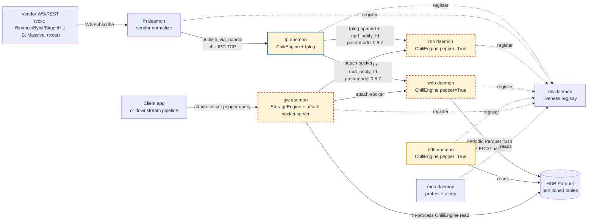
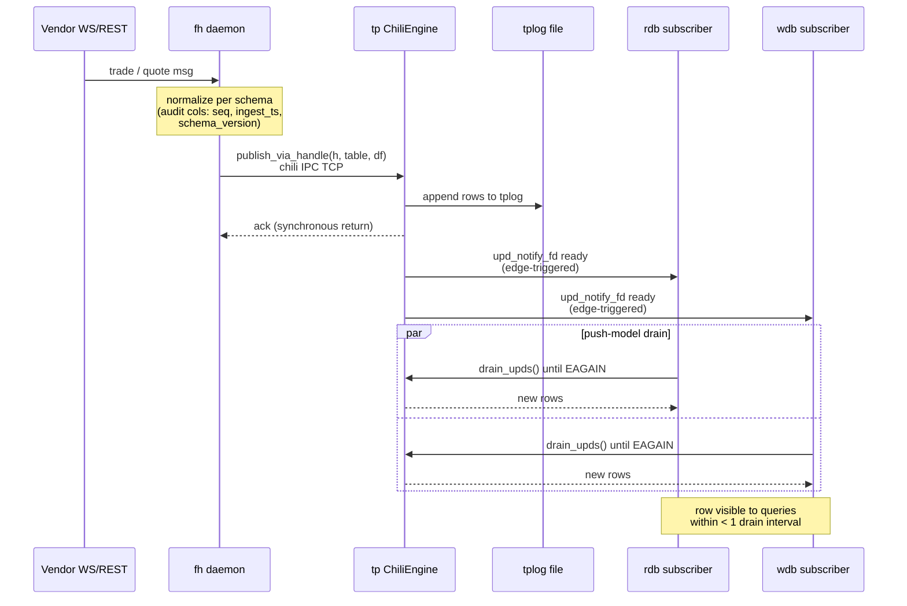
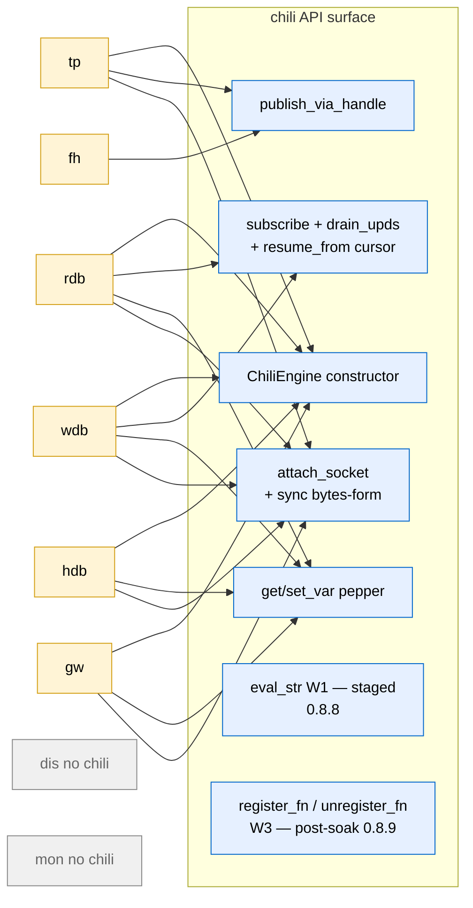
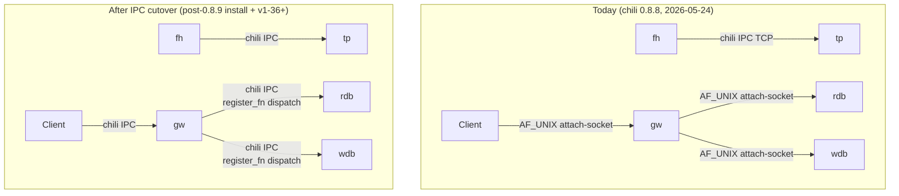

# mdata → chili — architecture handoff for chili-team review

**Date:** 2026-05-24
**From:** mdata project (claude branch, post-v1-35 pre-soak; 24h Pipeline X soak in flight on chili 0.8.8)
**To:** chili-team — for discussion with the chili original author about what chili could refactor or enhance to better support mdata's setup.
**Status:** Snapshot of mdata as of 2026-05-24. chili 0.8.8 in production; 0.8.9 (W3) install pending post-soak (Task #186).
**Mirror:** `~/code/chili/docs/sync/mdata_architecture_handoff_2026-05-24.md` (identical content).

## TL;DR for the chili author

mdata is a production-grade multi-asset time-series data warehouse built on chili Rust as the in-process pepper engine + cross-process IPC bus. As of v1-35, mdata runs **9 long-running Python daemons**; **7 of them embed `chili.ChiliEngine`** (4 with `pepper=True`); **6 publish a query surface via AF_UNIX attach-socket** wrapping chili pepper eval.

**All three open wishlist items shipped on chili's side within ~24h** (W1+W2 in 0.8.8, W3 in 0.8.9 same day). What's left open:

1. **Async surface** (`flush_tplog_async`, reader-fairness under sustained writer load) — `docs/sync/chili_wishlist_2026-05-22_async-surface.md`. mdata mitigated A-033 (asyncio loop saturation under 6944 msg/sec) with mdata-side executor dispatch (F1-F9 fix arc) but the underlying chili-side limitations remain.
2. **Producer-side fsync-before-broadcast seam** — `docs/sync/chili_note_2026-05-19_tplog_fsync_broadcast_seam.md`. Non-blocking; closes the cross-machine-survivor durability edge.
3. **IPC cutover possibility** — now that W3 ships `register_fn`/`unregister_fn`, mdata is planning (v1-36+) to retire its custom AF_UNIX attach-socket layer in favor of chili-IPC end-to-end. Proposal at `docs/proposals/ipc_cutover_remove_unix_socket_2026-05-24.md`. This handoff doc is also intended to surface architectural patterns the chili author might suggest changes to.

The rest of this doc is the architectural snapshot the chili author may want to see before suggesting refactors.

---

## 1. Daemon topology

mdata is a per-pipeline tickerplant architecture. A *pipeline* is one configuration of `(asset_class, vendor_set, machine, capture_cadence)`. Examples: Pipeline E (equity, Massive vendor, mid-day capture), Pipeline X (crypto, ccxt vendors, 24/7 capture), Pipeline A (private accounts, IB+nxcar, mid-day), Pipeline P (private accounts variant).

Within one pipeline, **9 daemons** cooperate. 8 of them are core data-path; `mon` is observability.

| Daemon | Module | Role | ChiliEngine? | attach-socket? | Cross-process IPC? |
|---|---|---|---|---|---|
| **tp** (tickerplant) | `src/mdata/tp/__main__.py` | Canonical writer — ingests publishes, appends tplog, broadcasts updates | YES (writes RDB partition) | YES (query surface) | **chili IPC** (TCP listener; receives `publish_via_handle` from fh) |
| **fh** (feed handler) | `src/mdata/fh/__main__.py` | Vendor adapter — subscribes vendor WS/REST, normalizes, publishes to tp | NO (RemoteTpClient) | NO | **chili IPC client** (calls `publish_via_handle` cross-process to tp) |
| **rdb** (real-time DB) | `src/mdata/rdb/__main__.py` | Recent-table reader — subscribes tplog via push-model, serves intra-day queries | YES (`pepper=True`) | YES (query surface) | AF_UNIX attach-socket today |
| **wdb** (write DB / pepper hot-table) | `src/mdata/wdb/__main__.py` | Per-partition mid-day Parquet flush + EOD finalize | YES (`pepper=True`) | YES (query surface) | AF_UNIX attach-socket today |
| **hdb** (historical DB) | `src/mdata/hdb/__main__.py` | Historical Parquet scan service | YES (`pepper=True`) | YES (query surface) | AF_UNIX attach-socket today |
| **gw** (gateway) | `src/mdata/gw/__main__.py` | Query facade — routes queries to rdb/wdb/hdb, fans out, merges | YES (StorageEngine wraps ChiliEngine for direct hdb Parquet reads) | YES (client-facing query surface) | AF_UNIX attach-socket (to rdb/wdb); in-process chili for hdb |
| **dis** (discovery) | `src/mdata/dis/__main__.py` | Liveness registry — daemons register, mon reads | NO | NO | TCP (custom protocol) |
| **mon** (monitor) | `src/mdata/mon/__main__.py` | Probe loop + alert dispatch — reads dis, runs invariants | NO | NO | reads dis, writes JSONL |
| (sub) | shared library | Subscription manager — embedded library, not a separate daemon | N/A | N/A | N/A |

**Verified counts (chili API surface in mdata source):**
- 9 `ChiliEngine(...)` constructor callsites across `src/mdata/`.
- 4 of them use `pepper=True` (rdb, wdb, hdb subscribers — engines that need pepper variable lookup at query time).
- 10 cross-process `publish_via_handle(h, table, df)` callsites — exclusively fh→tp.
- 0 `register_fn`/`unregister_fn` callsites today (0.8.9 not yet installed).

### Mermaid: per-pipeline data-flow topology



**Color/style key:** yellow box = daemon embeds `chili.ChiliEngine`; blue solid = chili IPC (TCP); red dashed = AF_UNIX attach-socket (mdata's custom wrapper around chili pepper eval); dotted = liveness/observability.

The **write path is already chili-IPC end-to-end** (fh → tp). The **query path is attach-socket** (Client → gw → rdb/wdb), with one exception: gw → hdb is in-process chili because gw embeds a ChiliEngine for direct Parquet reads. The IPC cutover proposal would unify the query path on chili-IPC.

### Hot publish path — sequence diagram (zoom)

The single most-exercised chili interaction in mdata. Every vendor tick travels this path:



This is the path that hit A-033 under sustained 6944 msg/sec load — the `flush_tplog` call from tp's periodic-flusher was blocking the event loop. mdata's F8 fix dispatches flush via `asyncio.to_thread`; an async surface in chili would obviate this.

---

## 2. chili API surface in production today

Concrete inventory of chili APIs invoked by mdata source (chili 0.8.8 as of 2026-05-24):

| chili API | mdata callsites | Used for |
|---|---|---|
| `ChiliEngine(...)` | 9 constructor sites | One per daemon (tp/rdb/wdb/hdb) + 2 StorageEngine wraps (gw/wdb writer) + 2 RemoteTpClient fallback + 1 default-engine fallback |
| `ChiliEngine(pepper=True)` | 4 sites | rdb / wdb / hdb subscribers — need pepper variable lookup at query time |
| `engine.publish_via_handle(h, table, df)` | 10 sites | fh → tp cross-process publish (the canonical write path) |
| `engine.subscribe(socket, topics, resume_from={...})` | 1 site (`common/drain_loop.py`) | rdb/wdb subscribe to tp's tplog with cursor resume on restart |
| `engine.upd_notify_fd()` + `drain_upds()` | wired in `common/drain_loop.py` | **Push-model (chili 0.8.7 W4)** — event-driven subscriber wake; replaces poll loop |
| `engine.get_var(name)` / `set_var(name, value)` | many (no count) | Pepper variable read/write — primary in-engine state mechanism (e.g., `.tick.upd`, `.tick.eod`) |
| `engine.eval_str(...)` (**W1, 0.8.8**) | 0 active mdata uses yet | Self-discovered bytes-form `sync(h, b"<src>")` covered our W1 need; eval_str builtin is staged but unconsumed |
| `chili.attach_socket` / `engine.attach_socket(...)` | 6 sites (tp/rdb/wdb/hdb + gw server + gw client) | mdata's custom query surface (AF_UNIX wrapping pepper eval) — graceful TCP shipped in **0.8.8 W2** |
| `engine.register_fn(name, callable, arity)` (**W3, 0.8.9**) | **0** | Python-callable bridge — to be adopted post-soak; enables IPC cutover |
| `engine.unregister_fn(name)` (**W3, 0.8.9**) | **0** | Same as above |
| Tuple-form `sync(h, (name, *args))` (**W3, 0.8.9**) | **0** | Remote dispatch of registered Python callable |

### Sub-engine pattern

Four daemons (rdb, wdb, hdb, gw) construct their engine with `pepper=True` because they need to evaluate user-supplied pepper queries (e.g., `select * from quote where seq within (s1; s2)`). tp uses `pepper=False` because it only writes via `publish_via_handle`.

**`StorageEngine` wrapper (mdata-internal, `src/mdata/db/storage.py`):** when an mdata daemon needs to read/write Parquet under its own pepper engine, it wraps `ChiliEngine` in `StorageEngine` which adds (a) partition-aware Parquet load helpers, (b) schema enforcement on write, (c) integration with mdata's audit columns (`seq`, `ingest_ts`, `schema_version`). gw wraps for hdb reads; wdb wraps for periodic-flush writes.

### Push-model (chili 0.8.7 W4) — load-bearing for mdata

`upd_notify_fd()` + `drain_upds()` replaced mdata's earlier poll-loop subscriber and is now load-bearing. Key invariants exercised in production:

- **Resume-from cursor.** `engine.subscribe(resume_from={...})` lets rdb/wdb restart and replay missed updates from the last durable position. Cursor stored in `src/mdata/common/cursor_store.py`.
- **No silent drops.** `drain_upds()` returns all updates appended since last drain; rdb's `RdbSubscriber` invariant is "every published row appears in cache within drain interval".

mdata's recovery scenarios (in `tests/recovery/`) exercise tp restart / rdb restart / wdb restart / fh restart with no row loss. These tests are the primary signal that the push-model is working correctly.

### Per-daemon chili API matrix (visual)

Same information as the table above, but laid out as a daemon→API bipartite graph for visual scan:



Key takeaways from the matrix: (a) `ChiliEngine` is the most-shared API (5 of 7 chili-using daemons); (b) `attach_socket` is used by every daemon that exposes a query surface (5 of 7); (c) `register_fn` (W3) currently has zero consumers — that's the IPC-cutover opportunity; (d) `eval_str` (W1) also has zero active mdata uses because the bytes-form `sync(h, b"...")` self-discovery in 0.8.7 covered our need before the W1 builtin shipped.

---

## 3. Cross-process call shape (chili IPC vs AF_UNIX attach-socket)

mdata uses **two distinct cross-process transports** today:

### Write path — chili IPC (TCP listener on tp)

- tp starts a chili IPC TCP listener (`engine.start_tcp_listener(port=...)`).
- fh connects via `RemoteTpClient(args.tp_url)` (`src/mdata/tp/remote_client.py:127`) → calls `publish_via_handle(h, table, df)` over chili IPC.
- This is the **canonical chili usage pattern** and works well. Throughput sustained at 6944 msg/sec aggregate during v1-32 6h soak (12/12 rc=0).

### Query path — AF_UNIX attach-socket (mdata's custom wrapper around pepper eval)

- rdb/wdb/hdb each start an AF_UNIX socket server (`src/mdata/common/attach_socket.py`).
- Client connects, sends pepper source text, server evaluates via `engine.sync(h, b"<src>")` (the W1 self-discovered bytes-form), returns serialized result.
- gw embeds a client-side `RemoteRdbClient` / `RemoteWdbClient` (`src/mdata/common/remote_client.py`) — wraps the AF_UNIX socket protocol.
- **MultiRdbRouter** (`src/mdata/common/remote_client.py:225`) — gw's HA router for multi-rdb-instance fanout (per gw multi-instance work, v1-33).

This second transport exists for two historical reasons:

1. **Pre-0.8.8 chili IPC was TCP-only**, and mdata wanted AF_UNIX for within-machine performance.
2. **Pre-0.8.9 chili had no Python-callable bridge**, so to evaluate arbitrary pepper from a remote client we had to either (a) push the query as a bytes literal, or (b) build our own dispatch layer. We chose AF_UNIX with bytes-form pepper eval.

W2 (graceful bare-TCP in 0.8.8) + W3 (register_fn in 0.8.9) together remove both reasons. The **IPC cutover proposal** (`docs/proposals/ipc_cutover_remove_unix_socket_2026-05-24.md`) Option A' migrates all 6 attach-socket surfaces to chili-IPC.

### Mermaid: today vs post-cutover



The cutover removes ~600 LOC of attach-socket plumbing (`attach_socket.py` + `remote_client.py` + per-daemon server boot). The trade-off is that mdata becomes more deeply coupled to chili-IPC semantics — which is fine *if* chili-IPC continues to evolve in ways that meet mdata's needs.

### Query fanout — sequence diagram (today, with post-cutover annotation)

The other most-exercised chili interaction: a client query landing at gw and fanning out across rdb instances + hdb. Highlights what `register_fn` (W3) would change:

```mermaid
sequenceDiagram
  participant C as Client
  participant GW as gw daemon
  participant MR as MultiRdbRouter
  participant R1 as rdb-1
  participant R2 as rdb-2
  participant HDB as in-process hdb engine

  C->>GW: query(table, seq within [s1, s2])
  GW->>MR: pick instance(s)
  Note over MR: selector: round-robin or<br/>least-outstanding-requests<br/>(gw multi-instance, v1-33)

  rect rgb(255,235,235)
    Note over GW,R2: TODAY — AF_UNIX attach-socket<br/>(mdata custom layer wrapping pepper eval)
    par fanout
      GW->>R1: send bytes-form pepper source
      R1-->>GW: serialized rows (custom wire format)
    and
      GW->>R2: send bytes-form pepper source
      R2-->>GW: serialized rows (custom wire format)
    end
  end

  GW->>HDB: in-process ChiliEngine read<br/>(StorageEngine + Parquet partition)
  HDB-->>GW: historical rows
  GW->>GW: merge shards (Polars LazyFrame)
  GW-->>C: merged result

  rect rgb(220,240,220)
    Note over GW,R2: POST-CUTOVER (v1-36+, on chili 0.8.9 W3)<br/>same flow; attach-socket replaced by:<br/>sync(h, ("mdata_query_recent", table, s1, s2))<br/>over chili IPC + register_fn dispatch
  end
```

Red rectangle = today's attach-socket path; green annotation = how W3 register_fn would replace it. Same call shape from the client's perspective; the gw → rdb leg changes transport + dispatch primitive.

### 3.1 EOD finalize state machine — multi-daemon coordination

End-of-day finalize is the most chili-semantics-sensitive flow in mdata because it crosses 3 daemons (tp → wdb → hdb), uses pepper variables for the handshake (`set_var(".tick.eod", ...)`), and must be idempotent / restart-safe. v1-35 added the wdb pepper shim (A-034) to make this autonomous; before, finalize was orchestrated by an external script.

```mermaid
stateDiagram-v2
  [*] --> Capturing: market open<br/>(fh publishing via tp; rdb + wdb on push-model)
  Capturing --> Capturing: vendor ticks<br/>(thousands/sec)

  Capturing --> EodSignal: tp set_var(".tick.eod", <ts>)<br/>(broadcast to subscribers)

  EodSignal --> WdbShimSees: wdb pepper shim (A-034)<br/>get_var(".tick.eod") handler fires
  WdbShimSees --> WdbDraining: wdb forces final drain_upds()

  WdbDraining --> PeriodicFlush: WdbPeriodicFlusher runs<br/>(time + memory triggers per PRD §3.3)
  PeriodicFlush --> FinalShardWritten: zstd Parquet to staging dir
  FinalShardWritten --> HdbPartitionRenamed: atomic rename<br/>staging → HDB partition_date=YYYY-MM-DD
  HdbPartitionRenamed --> EodSentinelCleared: mon probe sees clean state<br/>set_var(".sub.eod.fired", true)
  EodSentinelCleared --> [*]: market closed for the day

  WdbDraining --> SafetyTimeout: _eod_safety_loop fallback<br/>(if shim race or hang)
  SafetyTimeout --> WdbDraining: retry drain
```

Chili-semantics dependencies this flow exposes:

1. **`set_var` broadcast must be visible to all subscribers before next `drain_upds`.** If tp sets `.tick.eod` and wdb's next drain doesn't see it, the shim handler never fires and the safety-loop fallback (slow, polling) is what saves us.
2. **Final drain must be exhaustive.** `drain_upds()` must yield every row appended since the previous drain, including the EOD-marker row itself.
3. **Atomic Parquet rename is mdata-side, not chili** — but it depends on wdb's chili engine being quiesced (no in-flight writes) at rename time. If chili's writer holds an internal buffer past `flush_tplog`, the rename can race.

The state machine is *also* the reason the async-surface wishlist matters: under load, the `PeriodicFlush → FinalShardWritten` transition can stall the event loop (A-033 root cause). F8 (executor dispatch) mitigates today; native async `flush_tplog_async` would remove the workaround.

---

## 4. Wishlist status — what shipped, what's open

### Delivered (closed)

| Wishlist | mdata doc | chili delivery | chili version |
|---|---|---|---|
| **W1** — arbitrary pepper-eval over IPC | `chili_wishlist_2026-05-23_remote-eval-surface.md` | bytes-form `sync(h, b"...")` self-discovered; `eval_str` builtin in 0.8.8 | 0.8.8 |
| **W2** — graceful bare-TCP on `start_tcp_listener` (clean shutdown / restart) | Same doc | Shipped | 0.8.8 |
| **W3** — Python-callable bridge (`register_fn` + `unregister_fn` + tuple-form `sync(h, (name, *args))`) | Same doc | Shipped — wheel `chili_sauce-0.8.9-cp310-abi3-macosx_11_0_arm64.whl` | 0.8.9 |
| **W4** — Push-model (`upd_notify_fd` + `drain_upds`) — older wishlist | `chili_wishlist_2026-05-17_push-model.md` | Shipped, replaces poll loop | 0.8.7 |

### Open (not blocking, but on radar)

1. **Async surface** — `docs/sync/chili_wishlist_2026-05-22_async-surface.md`
   - **W1 (async).** `flush_tplog_async()` — currently `flush_tplog()` is sync, holds GIL, blocks the event loop. mdata mitigates by dispatching to `asyncio.to_thread` executor (A-033 fix F8) but native async would be cleaner.
   - **W2 (async).** Reader fairness under sustained writer load. mdata observed RwLock reader starvation during A-033 (6944 msg/sec writer); mitigated mdata-side with executor-bounded `__ping__` fast path (F7).
2. **Producer-side fsync-before-broadcast seam** — `docs/sync/chili_note_2026-05-19_tplog_fsync_broadcast_seam.md`
   - Closes the cross-machine-survivor durability edge per ADR-0009. Non-blocking; mdata's bounded-durability SLA (≤ 250 ms machine-failure loss) is met without it. Filed for future consideration.
3. **IPC cutover acceptance from chili side** — not a code ask, more a *design conversation*. mdata's current plan (Option A' in the IPC cutover proposal) leans heavily on `register_fn` + tuple-form `sync`. If the chili author sees a cleaner way for an embedding application to expose a pepper query surface to remote clients, we'd want to hear it before locking the design.

### Suggested topics for the chili-author discussion

Listed in priority order based on mdata's current pressure points:

1. **IPC cutover design review.** Before mdata commits ~10pp of v1-36+ to retiring attach-socket, is `register_fn` + tuple-form dispatch the right primitive, or should chili-IPC have a higher-level "remote pepper eval" surface? mdata's current use is mostly "evaluate this bytes source string, give me the result back" — that's what attach-socket does today via raw bytes-form sync.
2. **Async surface roadmap.** Even though mdata routed around the sync limitations with executor dispatch, the A-033 fix-arc (F1-F9, 8 commits) cost ~12pp. An async surface in chili would make future similar issues 1pp instead.
3. **Reader-writer fairness defaults.** mdata observed reader starvation in A-033 at sustained 6944 msg/sec writer load. Tunable? Default-fair? Was the v1-32 mitigation (executor-dispatch + `__ping__` fast-path) the right shape, or is there a chili-side knob we missed?
4. **Pepper query-result serialization.** mdata serializes pepper results manually over attach-socket today (custom protocol in `attach_socket.py`). With register_fn, can chili-IPC carry the result directly? If so, what's the wire format?
5. **`StorageEngine` wrap pattern.** mdata's `src/mdata/db/storage.py` adds partition-aware Parquet helpers + schema enforcement on top of ChiliEngine. Is this a pattern other embedding apps would want? Worth upstreaming a subset to chili?

---

## 5. Key invariants the chili-team should be aware of

These are the load-bearing invariants mdata relies on chili to preserve. If chili changes in a way that breaks any of these, mdata breaks.

1. **`subscribe(resume_from={...})` is exact.** If mdata stores cursor `c` and restarts, replay from `c+1` must yield exactly the rows tp appended after `c`. No duplicates, no gaps. Tested in `tests/recovery/test_recovery_scenarios.py`.
2. **`publish_via_handle` is atomic at the row level.** A successful return means the row is durably appended to tplog and visible to subscribers on next `drain_upds`.
3. **`upd_notify_fd()` is edge-triggered.** mdata's drain loop relies on EAGAIN semantics; we read until empty after every fd ready event.
4. **Pepper variables persist across `sync` calls within one engine.** mdata uses `set_var`/`get_var` for inter-call state (e.g., `.tick.eod`, `.tick.upd`, `.sub.eod.fired`).
5. **`pepper=True` engines evaluate q/pepper expressions identically to standalone chili.** mdata tests rely on q-equivalence (full pepper grammar).
6. **`attach_socket` (W2 graceful) survives `SIGTERM` mid-flight without orphaning client connections.** Verified by v1-34 chaos scenarios.

ADR-0006 (DSS envelope) is mostly an mdata concern but interacts with chili via `publish_via_handle` of the envelope rows.

ADR-0009 (Bounded Durability SLA) is the contract mdata advertises to its users; it's met today by chili's tplog + page-cache, modulo the cross-machine-survivor edge that chili note 2026-05-19 addresses.

---

## 6. Pipeline-level shape (for context)

mdata runs **4 pipelines** in production (per ADR-0007):

| Pipeline | Asset class | Vendors | Capture cadence | Status |
|---|---|---|---|---|
| **E** | Equity | Massive (REST + WS) | mid-day + EOD | v1-30 91-min soak ✅ |
| **X** | Crypto | ccxt (Binance/Bybit/Bitget/HL) | 24/7 streaming | v1-32 6h soak ✅; v1-35 24h soak IN FLIGHT |
| **A** | Private accounts | IB + nxcar | mid-day | Phase A shipped |
| **P** | Private accounts variant | IB + LTP (planned v1-37) | mid-day | LTP adapter design v4 |

All pipelines share the same daemon shape (the 9 daemons in §1) but with different `fh` adapters per vendor and different `gw` query routing tables. **chili usage is identical across pipelines** — the framework doesn't care about asset class.

Within one pipeline, chili is the engine layer (in-process pepper) AND the IPC bus (cross-process publish). mdata's user-visible API (Polars LazyFrame over gw) is built on top of chili's pepper query surface plus mdata's Parquet partitioning + Polars conversion.

---

## 7. Cross-references for the chili author

Existing mdata ↔ chili docs that may be useful pre-reading:

| Doc | Topic |
|---|---|
| `docs/sync/chili_wishlist_2026-05-17_push-model.md` | W4 push-model wishlist (delivered 0.8.7) |
| `docs/sync/chili_wishlist_2026-05-22_async-surface.md` | Async-surface wishlist (open) |
| `docs/sync/chili_wishlist_2026-05-23_remote-eval-surface.md` | W1+W2+W3 wishlist (all delivered) |
| `docs/sync/chili_note_2026-05-19_tplog_fsync_broadcast_seam.md` | Fsync-broadcast seam note (open, non-blocking) |
| `docs/proposals/ipc_cutover_remove_unix_socket_2026-05-24.md` | IPC cutover design (Option A' planned v1-36+) |
| `docs/sync/v1_32_a033_step1_findings_2026-05-21.md` | A-033 root cause + F1-F9 fix arc |
| `docs/decisions/0006-decision-stream-sink-envelope.md` | ADR-0006 DSS envelope contract |
| `docs/decisions/0007-deployment-topology.md` | ADR-0007 4-pipeline / 3-machine topology |
| `docs/decisions/0009-bounded-durability-sla.md` | ADR-0009 durability SLA chili interacts with |
| `docs/standards/chili_capability_inventory.md` | mdata's catalogue of chili APIs we depend on |

chili-side mirror docs already in place (mdata user can read them via `~/code/chili/docs/sync/`):

| Doc | Topic |
|---|---|
| `mdata_chili_2026-05-19_0.8.7_delivery.md` | chili-side W4 delivery record |
| `mdata_chili_2026-05-23_0.8.8_delivery.md` | chili-side W1+W2 delivery record |
| `mdata_chili_2026-05-24_0.8.9_delivery.md` | chili-side W3 delivery record |
| `upstream_v0.9_vs_claude-2_0.8.9_gap_analysis_2026-05-24.md` | chili's own forward-looking gap analysis |

---

## 8. Requested response shape

Not load-bearing — just what would be most useful to mdata when the chili author has time to respond:

1. **Sanity-check the topology.** Is mdata using chili the way the author intended? Or have we built around an API surface in a way that suggests a missing primitive?
2. **IPC cutover blessing or redirect.** Option A' (register_fn-based attach-socket replacement) is mdata's current plan. If there's a cleaner way to do "remote pepper eval over chili IPC", we'd rather know before v1-36 starts than after.
3. **Async-surface priority.** Is `flush_tplog_async` on the chili roadmap? If yes, when? If no, mdata stays with executor-dispatch (A-033 mitigation pattern) indefinitely — fine, just want to know.
4. **Anything we're not asking about that we should be.** mdata's view of chili is necessarily mdata-shaped. The chili author may see refactor opportunities we don't.

No deadline. Soak completes ~09:00 local Monday 2026-05-25; chili 0.8.9 install + W3 acceptance test follows; then v1-36 mock-prod cutover OR v1-37 LTP adapter (principal's call). IPC cutover (v1-36+) is the first sprint that would benefit from the chili author's input.

---

## Document provenance

**Drafted by:** mdata-side Claude (claude branch, `~/code/mdata`), 2026-05-24 evening (mid-soak; docs-only work safe).
**Verification:** every callsite count + version pin + cross-reference was grepped or read at draft time (per `~/.claude/rules/verify-before-claim.md`). One Explore-subagent audit pass over current source surfaced the figures in §1-§3.
**No changes to `src/mdata/`** while soak runs. This doc + chili-side mirror are the only artifacts.
